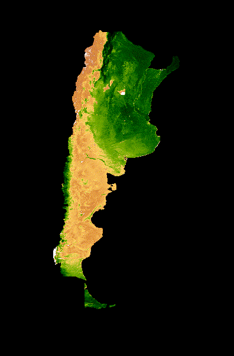
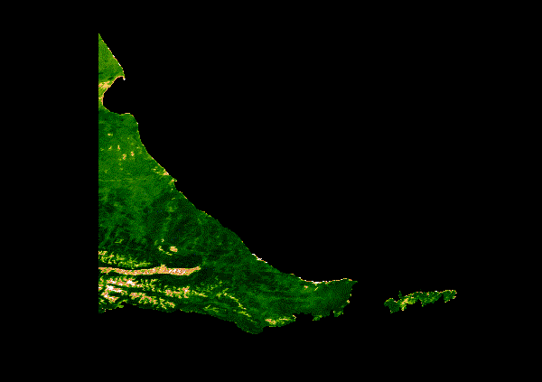

# Developing a Script to visualize 20-Year Median NDVI Trends in Argentina and Tierra Del Fuego
The script developed in this analysis generates an animated GIF representing 20-year median NDVI for serial 16-day MODIS composites spanning January 1st through December 31st. The tutorial uses [MODIS](https://modis.gsfc.nasa.gov/), a moderate resolution satellite, and [NDVI](https://en.wikipedia.org/wiki/Normalized_difference_vegetation_index), which is a common reflectance-based vegetation index. The [Earth Engine Data Catalog](https://developers.google.com/earth-engine/datasets/) provides NDVI as a precalculated [dataset](https://developers.google.com/earth-engine/datasets/catalog/MODIS_006_MOD13A2) for convenience. The script was developed by following this tutorial: [MODIS NDVI Times Series Animation tutorial on the GEE community web site](https://developers.google.com/earth-engine/tutorials/community/modis-ndvi-time-series-animation)

# NDVI Trends in Argentina
Argentina is a South American country spanning across many different biomes. The northeast contains warmer climates with abundant vegetation that are influenced by the warm ocean currents. The northwest region of Argentina is characterized by rough topography with hot and arid climates (Encyclopædia Britannica). The warm temperatures and variable altitudes limit the vegetation density, with shrubland being the dominating vegetation. Moving south, the altitude futher increases, which directly impacts climate of the southwestern Argentina. This region of the country is known its harsh environment, it is known as Patagonia. The Patagonia climate is defined by high altitude, which impacts the abundance and density of vegetation. Vegetation is most dense in areas on the western slopes of the Andes, due to the prominent rain-shadow effect occuring. Prevailing winds from the west (westerlies) lose much of the moisture as they move from the ocean to eastern elevations of the eastern Andes. By the time any system reaches the eastern high elevations of the Andes, they are void of substantial precipitation, limiting the productivity potential of vegetation (Viale, 2019). This phenomenon occurs throughout the western range of Argentina until the southern Argentina. The most southern poriton of Argentina contains the large archipelago, Tierra Del Fuego. 
> 

# Trends at the End of the Earth: Tierra Del Fuego
This unique region  
> 
